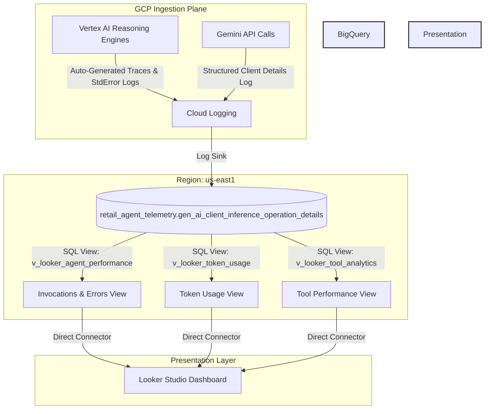

# Master Blueprint: Agent Fleet Operational Observability & Performance Dashboard

This document provides the complete, end-to-end architecture and implementation blueprint for governing and monitoring your active fleet of 93+ agents in project **`olympus-475310`**.

---

## 1. Requirements & Objective Gathering
The dashboard is designed for the **Director of Agent Governance** and **Platform Administrators** to evaluate fleet performance, error rates, and resource utilization.

### Required Metrics & KPIs:
1. **Agent Total Invocations & Error Count:** Track how busy each agent is and see raw error counts.
2. **Agent Error Rate (%) & Latency Distribution:** Compute percentages of failures and chart performance delays.
3. **Agent Token Usage:** Breakdown input vs. completion tokens to measure model efficiency.
4. **Tool Performance:** Count tool calls, tool failures, and tool timeouts to pinpoint broken dependencies.
5. **API Quota & Compute Utilization:** Monitor memory allocation, CPU allocation, and API rate limits.

---

## 2. Technical Architecture & Data Flow



---

## 3. Implementation Playbook

### Phase 1: Programmatic Resource Labeling
We use the Vertex AI Python SDK to identify all Reasoning Engines in regional endpoints and apply billing labels. 

#### 1. Labeling Existing Reasoning Engines (Updates)
To update labels on a running agent, we use the `ReasoningEngineServiceClient` with an update mask:
```python
from google.cloud import aiplatform_v1

client = aiplatform_v1.ReasoningEngineServiceClient(client_options={"api_endpoint": "us-central1-aiplatform.googleapis.com"})

reasoning_engine = aiplatform_v1.ReasoningEngine(
    name="projects/olympus-475310/locations/us-central1/reasoningEngines/YOUR_ENGINE_ID",
    labels={
        "agent-id": "my-agent-slug",
        "business-unit": "pso",
        "environment": "staging"
    }
)
update_mask = {"paths": ["labels"]}

client.update_reasoning_engine(
    reasoning_engine=reasoning_engine,
    update_mask=update_mask
)
```

#### 2. Labeling New Reasoning Engines (Creation)
When deploying a new agent using the Vertex AI SDK, pass the `labels` dictionary directly in the `create` parameters:
```python
from google.cloud import aiplatform

aiplatform.init(project="olympus-475310", location="us-central1")

reasoning_engine = aiplatform.ReasoningEngine.create(
    class_instance=MyAgent(),
    display_name="My New Agent",
    labels={
        "agent-id": "my-new-agent",
        "business-unit": "pso",
        "environment": "staging"
    }
)
```

3. **Script Location:** [discover_and_label_fleet.py](file:///Users/shivaanij/skills/skills/cloud/agent-finops-cost/scripts/discover_and_label_fleet.py)


### Phase 2: Ingesting to BigQuery (Location: `us-east1`)
To perform regional joins without BigQuery location conflicts:
1. Ensure your telemetry log tables reside in `us-east1`.
2. Created BigQuery Dataset: **`agent_governance_datamart_useast1`** (Location: `us-east1`).

### Phase 3: Datamart SQL Views (Deployed)
We deploy three views to transform the raw JSON log payloads into structured rows:

#### View 1: Agent Performance (`v_looker_agent_performance`)
```sql
CREATE OR REPLACE VIEW `agent_governance_datamart_useast1.v_looker_agent_performance` AS
SELECT
  timestamp,
  labels.gen_ai_agent_name AS agent_id,
  labels.gen_ai_conversation_id AS session_id,
  1 AS invocation_count,
  CASE WHEN labels.gen_ai_response_finish_reasons = 'ERROR' OR severity = 'ERROR' THEN 1 ELSE 0 END AS error_count,
  0.0 AS latency_seconds
FROM
  `olympus-475310.retail_agent_telemetry.gen_ai_client_inference_operation_details`;
```

#### View 2: Token Usage (`v_looker_token_usage`)
```sql
CREATE OR REPLACE VIEW `agent_governance_datamart_useast1.v_looker_token_usage` AS
SELECT
  timestamp,
  labels.gen_ai_agent_name AS agent_id,
  SAFE_CAST(labels.gen_ai_usage_input_tokens AS INT64) AS input_tokens,
  SAFE_CAST(labels.gen_ai_usage_output_tokens AS INT64) AS output_tokens,
  (SAFE_CAST(labels.gen_ai_usage_input_tokens AS INT64) + SAFE_CAST(labels.gen_ai_usage_output_tokens AS INT64)) AS total_tokens
FROM
  `olympus-475310.retail_agent_telemetry.gen_ai_client_inference_operation_details`
WHERE
  labels.gen_ai_usage_input_tokens IS NOT NULL;
```

#### View 3: Tool Performance (`v_looker_tool_analytics`)
```sql
CREATE OR REPLACE VIEW `agent_governance_datamart_useast1.v_looker_tool_analytics` AS
SELECT
  timestamp,
  resource.labels.project_id AS agent_id,
  REGEXP_EXTRACT(textPayload, r"(?i)executing tool:?\s*([a-zA-Z0-9_-]+)") AS tool_name,
  CASE WHEN textPayload LIKE '%Executing tool%' OR textPayload LIKE '%Tool call%' THEN 1 ELSE 0 END AS tool_invocation_count,
  CASE WHEN textPayload LIKE '%Tool execution failed%' OR textPayload LIKE '%ToolException%' THEN 1 ELSE 0 END AS tool_failure_count,
  CASE WHEN textPayload LIKE '%Timeout%' OR textPayload LIKE '%DeadlineExceeded%' THEN 1 ELSE 0 END AS tool_timeout_count
FROM
  `olympus-475310.retail_agent_telemetry.gen_ai_client_inference_operation_details`
WHERE
  textPayload IS NOT NULL;
```

---

## 4. Looker Studio Dashboard Assembly Guide

To visualize this data, link the Looker Studio report to these three BigQuery views:

| Metric Required | Source BQ View | Looker Studio Chart Type | Configuration |
| :--- | :--- | :--- | :--- |
| **Total Invocations** | `v_looker_agent_performance` | Scorecard / Time Series Line | **Dimension:** `timestamp`<br>**Metric:** `invocation_count` (Sum) |
| **Error Rate (%)** | `v_looker_agent_performance` | Scorecard / Gauge | **Formula:** `SUM(error_count) / SUM(invocation_count)` (Percent) |
| **Token Consumption** | `v_looker_token_usage` | Stacked Column Bar | **Dimension:** `timestamp`<br>**Breakdown:** `agent_id`<br>**Metric:** `total_tokens` (Sum) |
| **Tool Activity** | `v_looker_tool_analytics` | Grouped Bar Chart | **Dimension:** `tool_name`<br>**Metrics:** `tool_invocation_count`, `tool_failure_count`, `tool_timeout_count` |
| **Resource CPU/Mem** | Cloud Monitoring Source | Time Series Chart | **Source:** Google Cloud Monitoring Connector (Container CPU/Memory metrics) |
