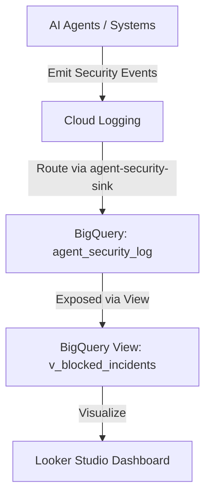

# Agent Mission Control

Deploys, configures, and audits the **Mission Control Log Pipeline**, **BigQuery Data Mart**, and **Looker Studio** views for AI Agent Governance (tracking blocked PII leaks, prompt injections, and runtime errors).

## Architecture Flow



---

## Directory Structure

```
cloud/agent-mission-control/
├── SKILL.md                 # AI Agent Instructions
├── README.md                # Project documentation (this file)
├── references/
│   ├── datamart_views.sql   # BigQuery SQL View definition
│   └── looker_dashboard_setup.md # Looker Studio connection guide
└── scripts/
    ├── 1_generate_test_logs.sh        # Generates mock security events
    ├── 2_deploy_sink_and_datamart.sh  # Sets up BigQuery, Sinks & IAM bindings
    └── 3_verify_pipeline.py           # Validates the BigQuery stream
```

---

## Simulated Security Event Payloads

The test log script ([1_generate_test_logs.sh](file:///Users/shivaanij/skills/skills/cloud/agent-mission-control/scripts/1_generate_test_logs.sh)) emits two types of mock JSON security log payloads to Cloud Logging:

### 1. PII Leak Prevention (Support Bot)
* **Agent ID:** `support-bot`
* **Business Unit:** `pso`
* **Environment:** `staging`
* **Action:** `BLOCK`
* **Reason:** `PII_LEAK_PREVENTED`
* **Severity:** `ERROR`

### 2. Prompt Injection Detection (Finance Agent)
* **Agent ID:** `finance-agent`
* **Business Unit:** `finance`
* **Environment:** `prod`
* **Action:** `BLOCK`
* **Reason:** `PROMPT_INJECTION_DETECTED`
* **Severity:** `ERROR`

---

## Step-by-Step Setup Guide

### Phase 1: Configure Environment

Set your target Google Cloud Project ID:
```bash
export PROJECT_ID="olympus-475310"
```

### Phase 2: Deploy Infrastructure

Run the deployment script to create the BigQuery dataset, Logging Sink, configure IAM bindings, and set up the SQL view:
```bash
bash cloud/agent-mission-control/scripts/2_deploy_sink_and_datamart.sh
```

### Phase 3: Emit Test Security Logs

Generate simulated security logs (e.g., prompt injection, PII leak alerts) to populate the BigQuery dataset:
```bash
bash cloud/agent-mission-control/scripts/1_generate_test_logs.sh
```

### Phase 4: Verify the Pipeline

1. Ensure the BigQuery Python library is installed:
   ```bash
   pip install google-cloud-bigquery
   ```

2. Authenticate your local Python credentials if needed:
   ```bash
   gcloud auth application-default login
   ```

3. Run the verification script:
   ```bash
   python3 cloud/agent-mission-control/scripts/3_verify_pipeline.py
   ```

*Alternative (CLI-only verification):*
If you prefer not to authenticate Python ADC, you can verify directly using the `bq` CLI:
```bash
bq query --use_legacy_sql=false --project_id=$PROJECT_ID "SELECT COUNT(*) as total FROM \`${PROJECT_ID}.agent_governance_datamart.v_blocked_incidents\`"
```


### Phase 5: Visualize in Looker Studio

1. Navigate to: https://lookerstudio.google.com/
2. Click **Create ➔ Blank Report**.
3. Select the **BigQuery Connector**.
4. Choose:
   * **Project:** `olympus-475310`
   * **Dataset:** `agent_governance_datamart`
   * **Table/View:** `v_blocked_incidents`
5. Click **Add** to begin building charts and visualizations!
